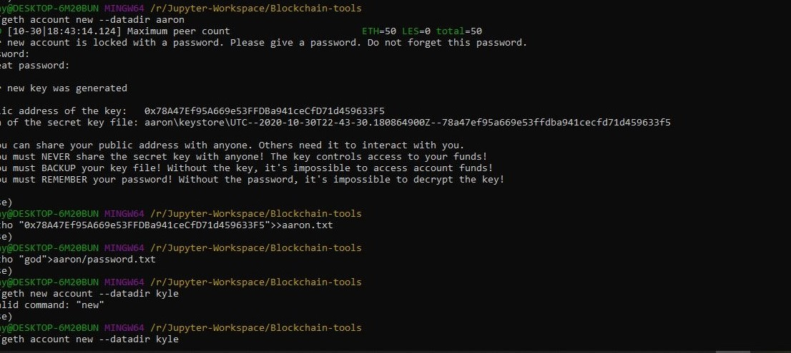
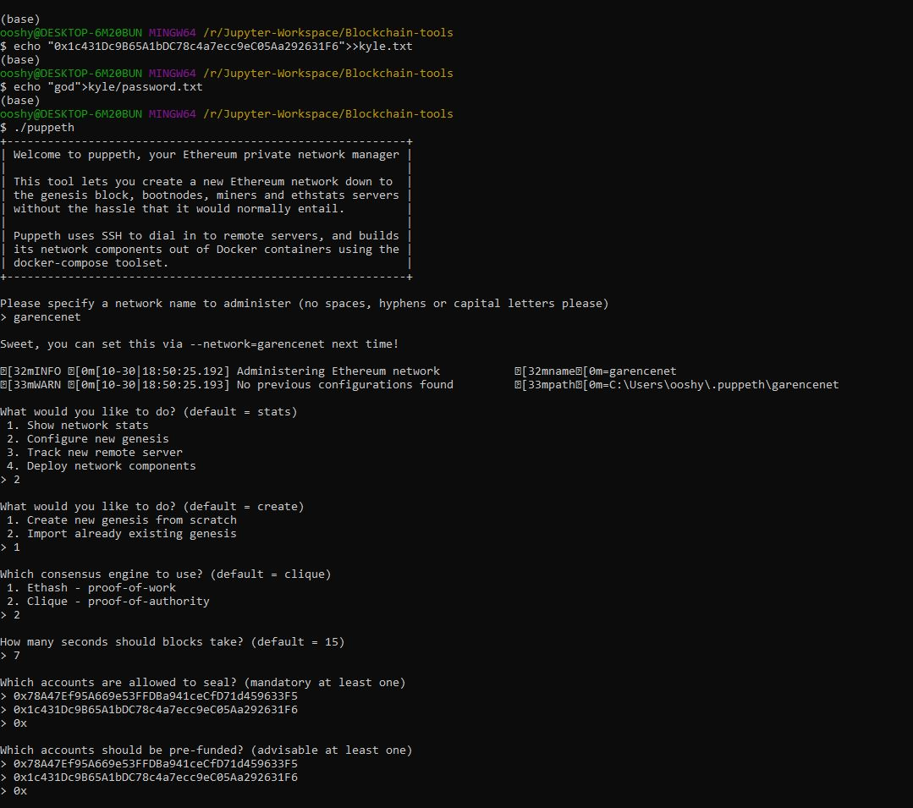
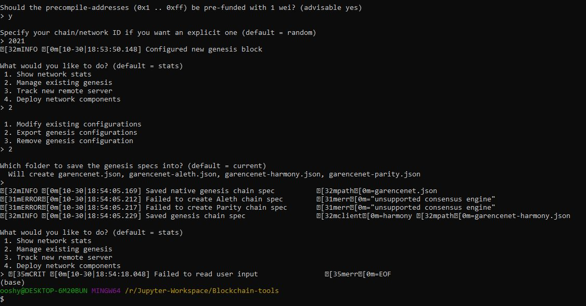
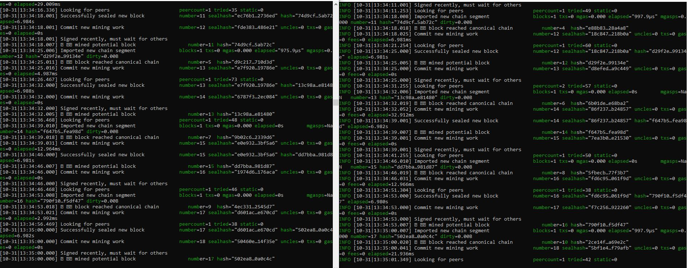
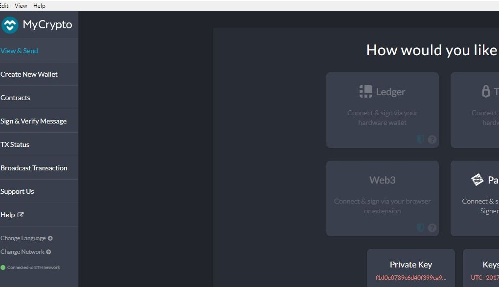
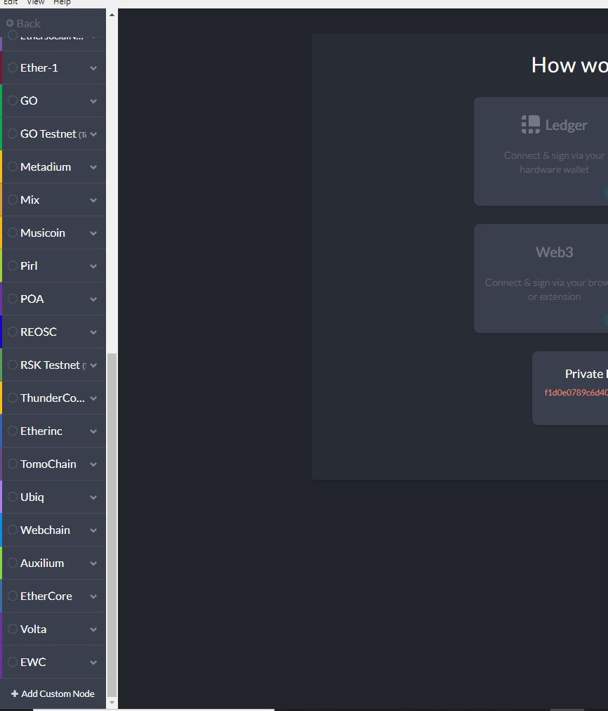
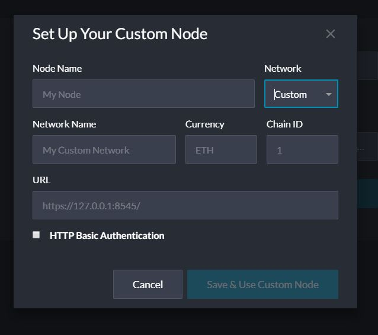
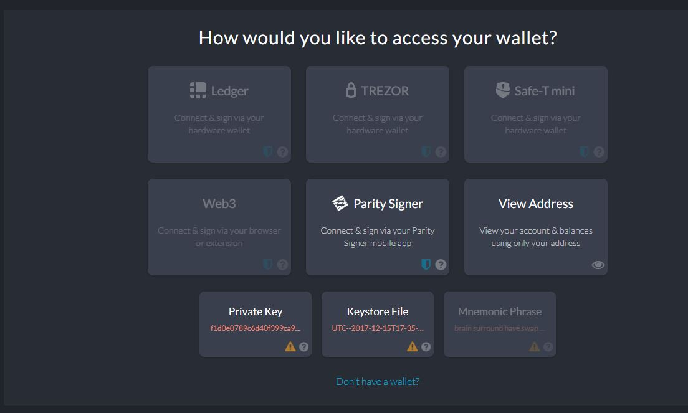
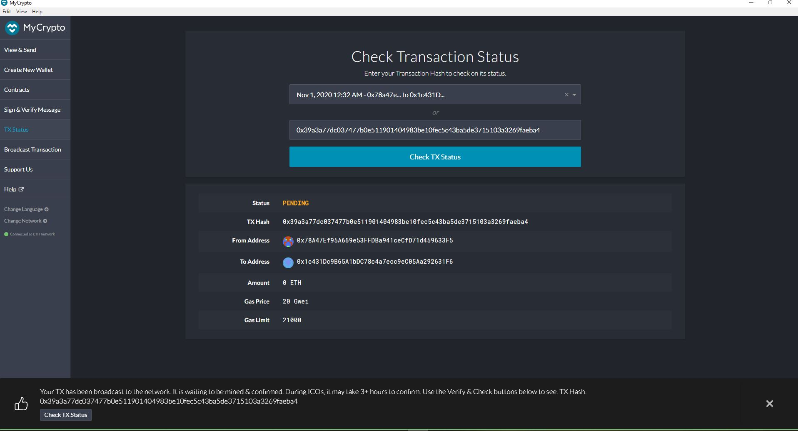
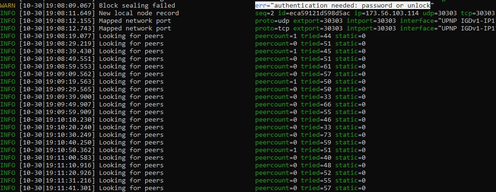

# Proof of Authority Development Chain

1. We started in class by downloading Go Ethereum Tools from https://geth.ethereum.org/downloads/
to create blockchain.

2. Navigate to the folder where we decompress Go Ethereum, in our case its Blockchain-tools
3. In case of deploying Clique Algorithm, nodes have to created first then creating a network unlike Proof of Work.

- I named node 1 after Aaron, our Instructor Assistant by running this command using geth

        ./geth account new --datadir aaron
- my node 2 is named afetr kyle, our Instructor Assistant I ran same command above after changing node name.
- will prompoted to set a password twice, which can be saved later in a text file & store it in the node folder.
- each node will generate public address key and path of secret key file
- store the public address  in text by running echo "node public key" nodename.txt
- store the password in text file by running echo "your password" node directory password.txt
- the public addresses will be later used to create 2 wallet, each connected to different node.
- the path of secret key will be stored in "keystore" folder in each node directory, each keystore file will be uploaded as private key when creating the 2 wallets.

1. Initiate the puppeth command to start building our network:
   
        ./puppeth
2. Sepcify the given name to the network, in my case I named it after Garence our Instructor & net for network, so garencenet
3. Next step is to build new genesis from scratch and to select Clique (PoA) as consensus engine
4. Then we will be asked how many seconds should block take. I chose 7 seconds as I only have 2 nodes
5. Sealer accounts are the voting nodes. Copy & paste public address of at least one node
6. At least one account has to be refunded.

7. Then, will be asked to specify network ID
8. Next is to manage our existing genesis to export the genesis configurations on the local directory; which consist of 4 json files:
   - garencenet.json 
   - garencenet-aleth.json
   - garencenet-harmony.json
   - garencenet-parity.json

9.  Now, it's time to initiate our nodes, opening two different git bash windows.. will run this command

        ./geth init garencenet.json --datadir aaron
        ./geth init garencenet.json --datadir kyle

10. Mining time for node1 which is aaron, run the following command and will be required to enter the node password

        ./geth --datadir nodename --mine --minerthreads 1

aaron (node 1) P2P network was displayed in screenshot above, notice port for instance starts at 30303 essentially P2P network generated for second node will be 30304:

        Started P2P networking                   
        self=enode://mixed of alphabetic & numeric code@rpcaddress:port

11.    to start mining in node 2 which is kyle, run the following command & a password will be required to unlock account.

    ./geth --datadir kyle --unlock "kyle_public_address" --port 30304 --bootnodes "enode:aaron enode" --ipcdisable --mine --minerthreads 2 --allow-insecure-unlock
node 2 P2P network has to be fetched & stored as well

    Started P2P networking                   
    self=enode://b25304c833d5773fe18809fdfd8074e90c990f8e4e1cc183e25065d7579c056a0d0f685260aa808598f5ca38dba0b029d874b8d84ea8db1ca63aa0215f753c33@127.0.0.1:30304

12. Now the 2 nodes will start looking for peers & matching other peers, a successful minning will look like screenshot below:

13. It's time to create custom nodes on my crypto app:
    
    - from Change Network in my crypto app
  
  
    
- select Add custom node

- will enter the first node name in the crossponding box
- network name is garencenet
- currency is ethereum
- chain ID is the network ID we specify in no. 7
- url is  "http:/127.0.0.1:8545"
- click save & use custom node
- will do the exact same steps for the second node

- navigate back to my crypto to start uploading keystore file for each node individually

- Unlock keystore file with the same password created for each node

14. Transfer ETH from node to another, check for transaction status

###  Challenges I faced:

1.  The first challenge I faced was when asked to enter password, if I used the password.txt for each node instead of typing it, I received an error due to failed authentication

2.  The second challange was connecting kyle node, I had to delete another node on a different network because of the url used was the same.
3.  despite the huge balance on each account is huge, the amount available to transfer to the second was far less than the transaction fee, so I transfer zero ethereum to show that the network & the 2 nodes are connected & active.

